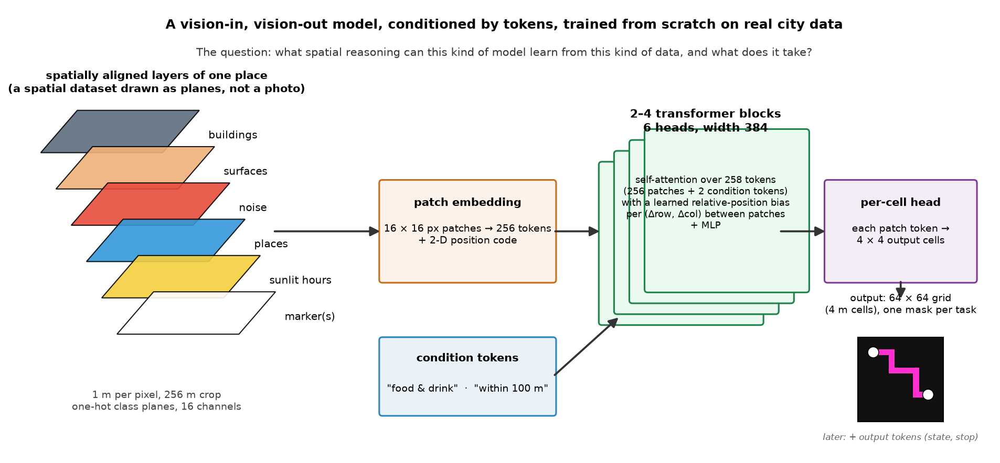
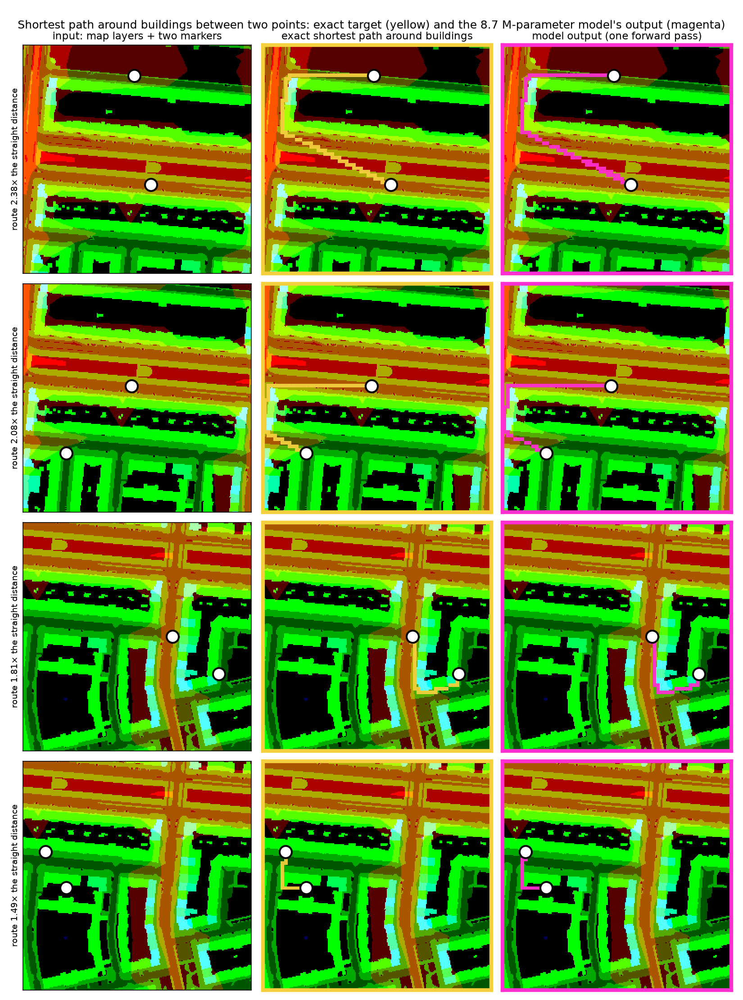
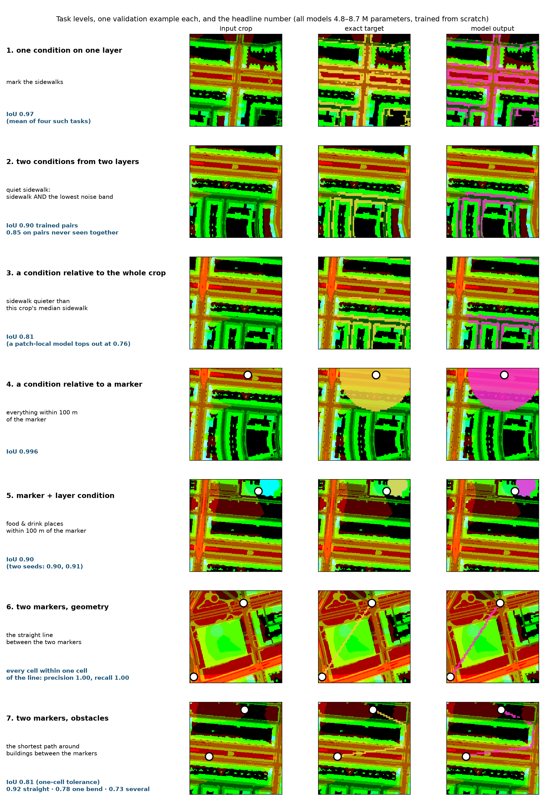
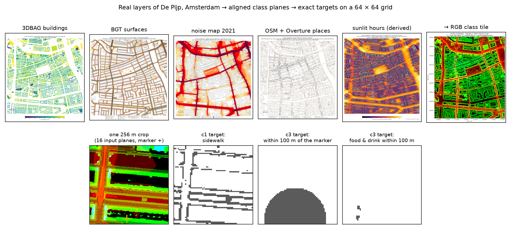

# Spatial reasoning from scratch on real city data



This repository is a study of one question: **what spatial reasoning can a small vision transformer learn when the input is not a photo but a set of spatially aligned data layers, and what does it take?**

The input is a 256 m square of Amsterdam drawn as planes: buildings from the 3D building register, surface types from the national base map, the road-noise map, places from OpenStreetMap and Overture, hours of sunshine computed from building heights. Every plane shows a different property of the same ground at the same pixel, one metre per pixel. On top of these the task can place one or two **markers**, points the question refers to ("within 100 m of *here*"). The question itself arrives as two **condition tokens** in front of the image tokens ("food & drink", "within 100 m"). The model answers with a **mask** on a 64 × 64 grid of 4 m cells. Everything in between is a plain transformer of 2 to 4 blocks, 5 to 9 million parameters, trained from scratch on one district.

Every task has an exact answer computed from the data, so every number below can be checked. The tasks form a ladder from "mark the sidewalks" to "draw the shortest path around the buildings from here to there", and the ladder ends where a single forward pass stops being enough.



*Four validation examples of the hardest task. Left: the map layers with two markers. Middle: the exact shortest path around buildings, computed geometrically. Right: what the 8.7 M-parameter model draws in one forward pass.*

## The tasks and the results



Seven task levels, one validation example each, and the headline number. Full numbers, seeds and run ids are in the two reports under `docs/reports/`; the run ledger `runs/experiments.json` holds every configuration.

What this is **not**: no vision-language model, no reinforcement learning, one city and one district. The path-finding numbers use a one-cell tolerance on one-cell-wide targets and say so. The *Limitations* section lists what is not claimed.

## What we learned

**1. A 9 M-parameter transformer finds shortest paths around obstacles in one pass, reasonably reliably.** Two markers, the building layer, and the exact Euclidean shortest path as the target. After 16k steps on 100k examples the model traces the right route in most cases: where the route is straight it is essentially perfect, where it bends once it is right four times in five, and where it has to turn several corners it is right about seven times in ten. The errors are concentrated in the many-corner routes, which is where a single forward pass runs out of steps. Two levers moved this task and they add up: five times more training examples, and four blocks instead of two. Two things that sounded helpful did not: a dense "mark the buildings" side task, and a looser gradient clip.

**2. The spatial encoding decides whether marker tasks can be learned at all; for tasks without markers it did not matter.** Tasks that only read the layers, "mark the sidewalks", "quiet sidewalks", reached their numbers with plain absolute position codes in 2k steps. Every task that refers to a marker stalled for thousands of steps or never started. Two changes fixed that, and neither works alone: draw the marker as a small disc instead of a single pixel, so the patch projection can see it, and give attention a learned bias for the offset between patches (the Swin-style relative position bias), so "look at the patches around the marker" is cheap to express. With both, "everything within 100 m of the marker" trains in 1.5k steps instead of 6k.

**3. Transfer between tasks happens, in both directions.** Two positive cases: a model trained on pairs of conditions composes pairs it never saw together (0.85 IoU on held-out pairs versus 0.01 with the wrong description), and the hard task "food & drink within 100 m" only became reliable when trained *together* with the plain "within 100 m" task: the easy task builds the circuit that routes information from the marker, and the hard task reuses it. Alone, the hard task escaped its shortcut in about half the runs; in the mix, in 10 of 11. One negative case: training the straight line between two markers alongside the shortest path *hurt* the path task. The two tasks share the output form and the input but contradict each other on the rule (through buildings versus around them), and they compete for the same circuit.

**4. What combined tasks cost.** A single-layer task trains in 2k steps with 4.8 M parameters. A task that combines a marker with a layer condition needed a three-task mix and 16k steps, roughly five times the presentations of the hard task itself. Path finding needed 100k examples, 16k steps at batch 128, and twice the model. The growth is in data and steps more than in parameters.

**5. A good score can hide a wrong solution.** "Food & drink within 100 m" has a shortcut: mark every food & drink place and ignore the marker. It scores 0.41 IoU, and ten configurations sat exactly there, including one with twice the parameters and four times the data. The probe that told the difference compares the prediction with each single-condition mask and plots the marked share by distance from the marker: flat for the shortcut, a step at 100 m for the solution. It is cheap and runs at the first evaluation.

## How it is built

- **Data** (`worldsnap/`): seven public layers of De Pijp, Amsterdam, downloaded with a manifest (source, licence, vintage, checksum), rasterised at 1 m, cut into 256 m crops; a derived sunshine layer from a sun-position formula and a ray-march over building heights. Nothing is cleaned; oddities are documented. Licences per layer: `DATA_LICENSES.md`.
- **Tasks** (`spatial_data/`): targets computed from the planes on the GPU; conditions as tokens; markers as a plane; shortest paths from a visibility graph over the building outlines, verified against a grid search. Held-out ground is four scattered blocks of the district no training crop touches.
- **Model** (`plain_gpt_module/`): 16 px patches, 2-D sine-cosine positions, 2 or 4 blocks of 6 heads at width 384, an optional learned relative position bias per block, two condition tokens, a per-cell head. Written from scratch; `LOCAL_MODEL_GUIDE.md` is the document it was built from.
- **Training and diagnostics** (`harness/`): a run ledger, and a diagnostics suite that records per evaluation the attention entropy and attention-to-marker of every head, per-group update ratios and gradient norms, and prediction strips. Most of the findings above were read off those, not off the loss.



## Running it

```bash
pip install -r requirements.txt
python -m pytest tests -q          # data-dependent tests skip without the sample bundle
```

`REPRODUCE.md` lists the pipeline commands, layers → crops → path store → one run per task level, with wall times on an RTX 3060, and how to load a released checkpoint (one model per task level in the GitHub release).

## Limitations

- One district of one city; no transfer to other ground was tested.
- No vision-language model and no reinforcement learning; the original plan for a tool-using VLM agent was set aside once the layer data existed.
- The path-finding numbers use a one-cell tolerance on one-cell-wide targets; the plain IoU is reported next to them.
- Most path-finding configurations are single-seed; the reference specification has two seeds 0.013 apart, and no difference below 0.02 is claimed.
- Courtyards count as free ground in the path task, by decision.

## Outlook

The many-corner routes are the argument for the next model: let it run a search over several passes, with its own previous output as an extra input, the distance wavefront as a dense per-pass target, and a learned stop token, so that longer routes get more passes. The design is in `docs/memo/ITERATIVE_SEARCH_2026-09-25.md`; the one-shot model above is the number it has to beat.

## Related work, in one paragraph

Vision-language map benchmarks (MapEval, MapQA, RewardMap) test frontier models on map images; this project is their controlled counterpart, aligned layers with exact targets and a model small enough to open. The relative position bias is Swin's (Liu et al. 2021); point prompts as tokens (Segment Anything, Kirillov et al. 2023) are the road not taken. The shortcut is shortcut learning in the sense of Geirhos et al. 2020; the heads sinking onto the constant condition tokens are the attention-sink phenomenon (Xiao et al. 2023) in a tiny ViT; the mix findings are small data points for the task-grouping literature (Standley et al. 2020). The iterative outlook builds on Deep Thinking networks (Schwarzschild et al. 2021; Bansal et al. 2022) and neural algorithmic reasoning (Veličković and Blundell 2021).

## Authorship and licence

Marvin Uhlmann, with Claude (Anthropic) and Cursor Composer as assistants; the split is in `AUTHORSHIP.md`. Code is MIT-licensed (`LICENSE`); data sources and their licences are in `DATA_LICENSES.md`.
